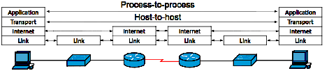
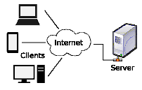

# DiscoverNetHTTP
Discovering the `net/http` package in Go. The provided web application demonstrates how to create and send GET and POST HTTP requests to the working web application using Golang. The result is a new user registration with added information to the SQL Database.

To check out the Go `net/http` package, visit [net/http package](https://golang.org/pkg/net/http/).

The application utilizes the following additional packages:

- `mime/multipart`: [MIME multipart](https://golang.org/pkg/mime/multipart/)
- `net/textproto`: [net/textproto](https://golang.org/pkg/net/textproto/)
- `context`: [Context](https://golang.org/pkg/context/)
- `net/url`: [net/url](https://golang.org/pkg/net/url/)

For testing purposes, you can use the web app from [ForumFFF GitHub Repository](https://github.com/Pomog/ForumFFF).

To learn more about Golang, visit the [official Go documentation](https://golang.org/doc/).

# Table of Contents
1. [DiscoverNetHTTP](#discovernethttp)
2. [TCP/IP (Internet Protocol Suite)](#tcpip-internet-protocol-suite)
   - [TCP/IP Framework](#tcpip-framework)
   - [Foundational Protocols](#foundational-protocols)
   - [Minimal TCP/IP Implementation Includes](#minimal-tcpip-implementation)
3. [The Hypertext Transfer Protocol (HTTP)](#the-hypertext-transfer-protocol-http)
   - [Journey of an HTTP Request](#journey-of-an-http-request)
   - [Three-Way Handshake](#three-way-handshake)
4. [TCP Segments](#tcp-segments)
5. [Capturing Network Traffic](#capturing-network-traffic)
   - [Example of Using tcpdump with Default Verbosity Level](#example-of-using-tcpdump-with-default-verbosity-level)
6. [HTTP Status Codes](https://www.restapitutorial.com/httpstatuscodes.html)

# TCP/IP (Internet Protocol Suite)

Internet Protocol (IP) is a connectionless (CL-mode communication used in packet switching networks in which each data unit is individually addressed and routed based on information carried in each unit) datagram service with no delivery guarantees. Its function in routing is to transport datagrams to the next host, functioning as an IP router, that has the connectivity to a network closer to the final data destination.

Transmission Control Protocol (TCP) responsibility is end-to-end acknowledgment and retransmission.

## TCP/IP Framework:
TCP/IP is a framework for organizing the set of communication protocols (system of rules) used in the Internet and similar computer networks according to functional criteria. TCP/IP provides end-to-end data communication specifying how data should be packetized, addressed, transmitted, routed, and received. This functionality is organized into four abstraction layers:

1. **Link Layer:**
   - Deals with the physical connection between devices on the same network.

2. **Internet Layer:**
   - Responsible for logical addressing, routing, and fragmentation and reassembly of data.

3. **Transport Layer:**
   - Ensures end-to-end communication and data flow control between applications on different devices.

4. **Application Layer:**
   - Provides network services directly to end-users or application processes. This layer hosts protocols like SMTP, FTP, SSH, HTTP, and DNS. Processes are addressed via ports representing services.

   
According to the end-to-end principle, the network is only responsible for providing the terminals with best-effort connections. Features such as reliability and security must be provided by mechanisms and protocols located at the terminals.

## Foundational Protocols:
The foundational protocols of the Internet protocol suite (TCP/IP) are:
- Transmission Control Protocol (TCP): A connection-oriented byte-stream transport layer protocol.
- Internet Protocol (IP): The Internet layer protocol.
- User Datagram Protocol (UDP): A connectionless transport layer protocol, used for real-time applications where low latency is more critical than guaranteed delivery.

## Minimal TCP/IP Implementation:
- Internet Protocol (IP)
- Address Resolution Protocol (ARP)
- Internet Control Message Protocol (ICMP)
- Transmission Control Protocol (TCP)
- User Datagram Protocol (UDP)
- Internet Group Management Protocol (IGMP)

In addition to IP, ICMP, TCP, UDP, Internet Protocol version 6 requires:
- Neighbor Discovery Protocol (NDP)
- ICMPv6
- Multicast Listener Discovery (MLD)
- Integrated IPSec security layer

*Look further - QUIC transport layer network protocol; OSI model.*

---

# The Hypertext Transfer Protocol (HTTP)

   

HTTP is an application layer protocol in the Internet protocol suite model.

A web browser (client) communicates with a process (web server) running on a computer hosting websites. The client submits an HTTP request, and the server returns a response. Intermediate network elements like Proxy servers, Routers, Switches, Firewalls, Load Balancers, Gateways, Content Delivery Networks, Network Address Translation (NAT) Devices, and WAN Optimizers can complement HTTP communication.

## Journey of an HTTP Request:
In networking, communication between devices occurs in the form of **packets** or **segments**. A TCP segment is a unit of data used by the Transmission Control Protocol (TCP) for communication between devices over a network. It is part of the **transport layer** in the TCP/IP protocol suite.
This packet-based communication enables efficient and reliable data transmission across diverse and interconnected networks.

1. **Client Initiates Request:**
   - A client (web browser or app) initiates an HTTP request.

2. **DNS Resolution:**
   - If the URL contains a domain name, the client performs DNS resolution to obtain the server's IP address.

3. **TCP Connection Establishment:**
   - The client establishes a TCP connection with the server using a three-way handshake.

4. **HTTP Request Sent:**
   - The client sends an HTTP request containing method, resource, headers, and, for POST, a request body.

5. **Server Processes Request:**
   - The server processes the request, identifies the resource, and prepares a response.

6. **Server Generates Response:**
   - The server generates an HTTP response with [status code](https://www.restapitutorial.com/httpstatuscodes.html), headers, and response body.

7. **HTTP Response Sent:**
   - The server sends the response to the client through the established TCP connection.

8. **Client Processes Response:**
   - The client receives the response, checks the [status code](https://www.restapitutorial.com/httpstatuscodes.html), and processes the response body.

9. **Rendering (for HTML content):**
   - If HTML content, the client renders the page, parsing HTML, rendering CSS, executing JavaScript.

10. **Connection Closure (Optional):**
    - The TCP connection may close, but modern apps often reuse connections for subsequent requests (HTTP keep-alive).

## Three-Way Handshake:
   - Connection Initialization: SYN flag, sequence numbers exchanged.
   - Synchronization: SYN and ACK flags, sequence numbers synchronized.
   - Acknowledgment: ACK flag, both parties confirm receipt of initial information.

---

# TCP Segments

A TCP segment is a chunk of data transmitted between devices. Key components include:
- Source Port and Destination Port: Identify sender and receiver applications.
- Sequence Number: Indicates segment position in the data stream.
- Acknowledgment Number: Confirms received segments.
- Flags: Control information (SYN, ACK, FIN, etc.).
- Window Size: Specifies data amount before acknowledgment.
- Checksum: Provides error checking.
- Data: Payload/content being transmitted.

TCP segments are encapsulated into IP packets. Key components of an IP packet include:
- Header: IP version, length, type of service, TTL, protocol, addresses.
- Payload: Actual data transmitted.
- Trailer (Optional): IPv6 introduces a Trailer for optional extensions.

---

# Capturing Network Traffic

Using the tcpdump tool with specific options to capture and display network traffic
on the loopback interface (lo) that is using port 8080.

Capture traffic on the loopback interface related to port 8080 using tcpdump:
The default verbosity level:
```bash
sudo tcpdump -i lo port 8080
```
Moderate verbosity: -v. Higher verbosity: -vv. Maximum verbosity: -vvv

## Example of Using tcpdump with Default Verbosity Level

//  handshake 
10:29:45.371003 IP6 ip6-localhost.57216 > ip6-localhost.http-alt: Flags [S], seq 2098262265, win 65476, options [mss 65476,sackOK,TS val 3317305516 ecr 0,nop,wscale 7], length 0
10:29:45.371018 IP6 ip6-localhost.http-alt > ip6-localhost.57216: Flags [S.], seq 1063465473, ack 2098262266, win 65464, options [mss 65476,sackOK,TS val 3317305516 ecr 3317305516,nop,wscale 7], length 0
10:29:45.371027 IP6 ip6-localhost.57216 > ip6-localhost.http-alt: Flags [.], ack 1, win 512, options [nop,nop,TS val 3317305516 ecr 3317305516], length 0

// The client send HTTP-GET - server acknowledge - server responded HTTP 200 OK 
10:29:45.380624 IP6 ip6-localhost.57216 > ip6-localhost.http-alt: Flags [P.], seq 1:710, ack 1, win 512, options [nop,nop,TS val 3317305526 ecr 3317305516], length 709: HTTP: GET / HTTP/1.1
10:29:45.380665 IP6 ip6-localhost.http-alt > ip6-localhost.57216: Flags [.], ack 710, win 506, options [nop,nop,TS val 3317305526 ecr 3317305526], length 0
10:29:45.380866 IP6 ip6-localhost.http-alt > ip6-localhost.57216: Flags [P.], seq 1:131, ack 710, win 512, options [nop,nop,TS val 3317305526 ecr 3317305526], length 130: HTTP: HTTP/1.1 200 OK

//  handshake -  another TCP connection is initiated,
10:29:45.380871 IP6 ip6-localhost.57218 > ip6-localhost.http-alt: Flags [S], seq 638398718, win 65476, options [mss 65476,sackOK,TS val 3317305526 ecr 0,nop,wscale 7], length 0
10:29:45.380880 IP6 ip6-localhost.http-alt > ip6-localhost.57218: Flags [S.], seq 3352290462, ack 638398719, win 65464, options [mss 65476,sackOK,TS val 3317305526 ecr 3317305526,nop,wscale 7], length 0
10:29:45.380888 IP6 ip6-localhost.57218 > ip6-localhost.http-alt: Flags [.], ack 1, win 512, options [nop,nop,TS val 3317305526 ecr 3317305526], length 0

//  The client acknowledges the response for the root path request
10:29:45.380899 IP6 ip6-localhost.57216 > ip6-localhost.http-alt: Flags [.], ack 131, win 511, options [nop,nop,TS val 3317305526 ecr 3317305526], length 0
// The client sends another HTTP GET request
10:29:45.409893 IP6 ip6-localhost.57216 > ip6-localhost.http-alt: Flags [P.], seq 710:1319, ack 131, win 512, options [nop,nop,TS val 3317305555 ecr 3317305526], length 609: HTTP: GET /favicon.ico HTTP/1.1
//  The server acknowledges the receipt
10:29:45.409944 IP6 ip6-localhost.http-alt > ip6-localhost.57216: Flags [.], ack 1319, win 508, options [nop,nop,TS val 3317305555 ecr 3317305555], length 0
//  The server responds with an HTTP 200 OK 
10:29:45.410164 IP6 ip6-localhost.http-alt > ip6-localhost.57216: Flags [P.], seq 131:261, ack 1319, win 512, options [nop,nop,TS val 3317305555 ecr 3317305555], length 130: HTTP: HTTP/1.1 200 OK
// The client acknowledges the HTTP 200 OK response
10:29:45.410180 IP6 ip6-localhost.57216 > ip6-localhost.http-alt: Flags [.], ack 261, win 511, options [nop,nop,TS val 3317305555 ecr 3317305555], length 0
//  The client 57218 initiates a TCP connection termination (FIN)
10:29:53.577465 IP6 ip6-localhost.57218 > ip6-localhost.http-alt: Flags [F.], seq 1, ack 1, win 512, options [nop,nop,TS val 3317313722 ecr 3317305526], length 0
// Again initiating a TCP connection termination by client 57216
10:29:53.577685 IP6 ip6-localhost.57216 > ip6-localhost.http-alt: Flags [F.], seq 1319, ack 261, win 512, options [nop,nop,TS val 3317313723 ecr 3317305555], length 0
// The server responds to the client's FIN with its own FIN flag
10:29:53.577718 IP6 ip6-localhost.http-alt > ip6-localhost.57218: Flags [F.], seq 1, ack 2, win 512, options [nop,nop,TS val 3317313723 ecr 3317313722], length 0
// The client acknowledges the server's FIN
10:29:53.577758 IP6 ip6-localhost.57218 > ip6-localhost.http-alt: Flags [.], ack 2, win 512, options [nop,nop,TS val 3317313723 ecr 3317313723], length 0
// The server responds to the client's FIN with its own FIN flag
10:29:53.577771 IP6 ip6-localhost.http-alt > ip6-localhost.57216: Flags [F.], seq 261, ack 1320, win 512, options [nop,nop,TS val 3317313723 ecr 3317313723], length 0
// The client acknowledges the server's FIN
10:29:53.577828 IP6 ip6-localhost.57216 > ip6-localhost.http-alt: Flags [.], ack 262, win 512, options [nop,nop,TS val 3317313723 ecr 3317313723], length 0

